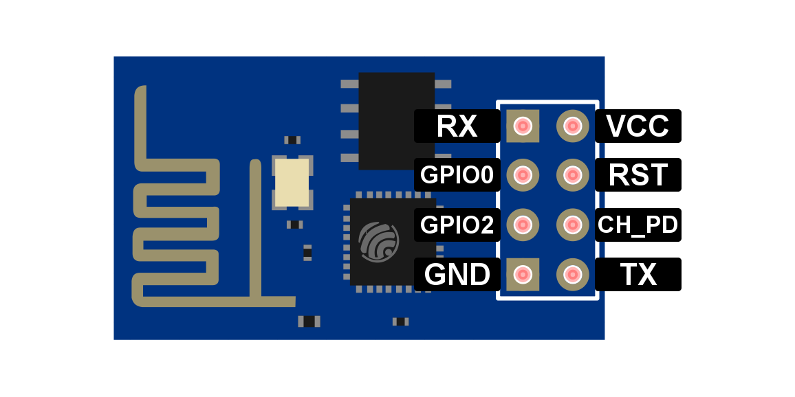

# KettleIoT
## Overview
Smart kettle whose approach to boil water will never let you down.
## Description
Kettle like this can be handled remotely through website. There are a few parameters that are provided to set: temperature, alarm, heat holding time and one of two modes of work you are obligated to chose:
First one enables to boil water and then keeps temperature at given value. The second one simply allows to hold temperature.

The base of the kettle has a diode which changes color ranging from red to green if kettle is placed on it, otherwise color turns blue.

When temperature reach a proper value the buzzer is activated.
## Tools

FT232 USB UART Board (Type A) - for testing correct output of certain modules

ESP8266-01

## How to run

ESP8266-01

- Pins connection for firmware update.

<table>
  <tr align="center">
    <th>ESP8266-01</th>
    <th>FT232</th>
    <th>STM32F4</th>
  </tr>
  <tr align="center">
    <td>VCC</td>
    <td>VCCIO (3.3V)</td>
    <td>-</td>
  </tr>
  <tr align="center">
    <td>GND</td>
    <td>GND</td>
    <td>-</td>
  </tr>
  <tr align="center">
    <td>Rx</td>
    <td>Tx</td>
    <td>-</td>
  </tr>
  <tr align="center">
    <td>Tx</td>
    <td>Rx</td>
    <td>-</td>
  </tr>
  <tr align="center">
    <td>RTS</td>
     <td rowspan="2" colspan="2">connected</td>
  </tr>
  <tr align="center">
    <td>CH_PD</td>
  </tr>
  <tr align="center">
    <td>GPIO0</td>
    <td>-</td>
    <td><b>GND</b></td>
  </tr>
  <tr align="center">
    <td>GPIO2</td>
    <td>-</td>
    <td>-</td>
  </tr>
</table>

- Pins connection for tests

<table>
  <tr align="center">
    <th>ESP8266-01</th>
    <th>FT232</th>
    <th>STM32F4</th>
  </tr>
  <tr align="center">
    <td>VCC</td>
    <td>-</td>
    <td>3V</td>
  </tr>
  <tr align="center">
    <td>GND</td>
    <td>-</td>
    <td>GND</td>
  </tr>
  <tr align="center">
    <td>Rx</td>
    <td>-</td>
    <td>PC10 (Tx)</td>
  </tr>
  <tr align="center">
    <td>Tx</td>
    <td>Rx</td>
    <td>-</td>
  </tr>
  <tr align="center">
    <td>RTS</td>
    <td rowspan="2" colspan="2">connected</td>
  </tr>
  <tr align="center">
    <td>CH_PD</td>
  </tr>
  <tr align="center">
    <td>GPIO0</td>
    <td>-</td>
    <td>-</td>
  </tr>
  <tr align="center">
    <td>GPIO2</td>
    <td>-</td>
    <td>-</td>
  </tr>
</table>

- Pins connection in project

<table>
  <tr align="center">
    <th>ESP8266-01</th>
    <th>STM32F4</th>
  </tr>
  <tr align="center">
    <td>VCC</td>
    <td>3V</td>
  </tr>
  <tr align="center">
    <td>GND</td>
    <td>GND</td>
  </tr>
  <tr align="center">
    <td>Rx</td>
    <td>PC10 (Tx)</td>
  </tr>
  <tr align="center">
    <td>Tx</td>
    <td>PC11 (Rx)</td>
  </tr>
  <tr align="center">
    <td>RTS</td>
    <td rowspan="2">connected</td>
  </tr>
  <tr align="center">
    <td>CH_PD</td>
  </tr>
  <tr align="center">
    <td>GPIO0</td>
    <td>-</td>
  </tr>
  <tr align="center">
    <td>GPIO2</td>
    <td>-</td>
  </tr>
</table>
**important notices:**
Use your own ssid, password and ip address to network connection.

## How to compile
- System Workbench for STM32
## Future improvements
Add more precise external RTC
## Attributions
[Source of external libraries](https://github.com/MaJerle/stm32fxxx_hal_libraries)
## License
Distributed under **MIT** license
## Credits

- [Marcin Borzymowski](https://github.com/BMarcin) 
- [Adam Chrzanowski](https://github.com/chradam)

*The project was conducted during the Microprocessor Lab course held by the Institute of Control and Information Engineering, Poznan University of Technology.
Supervisor: [`Tomasz Mańkowski`](https://github.com/Tomasz-Mankowski)*
